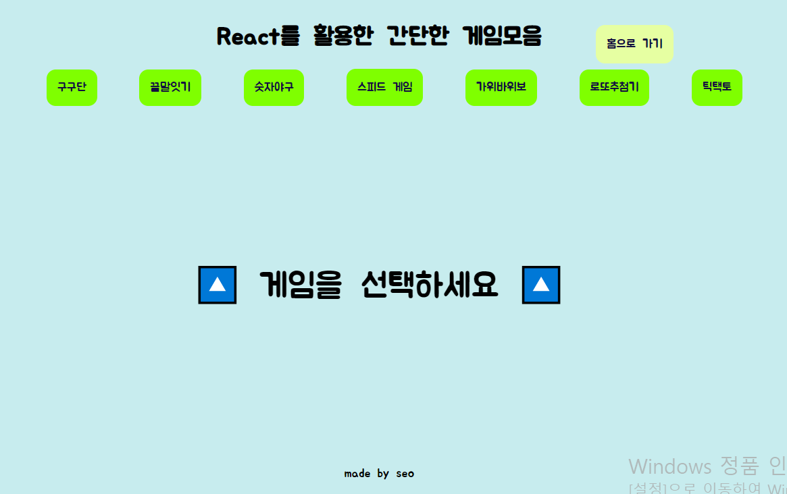
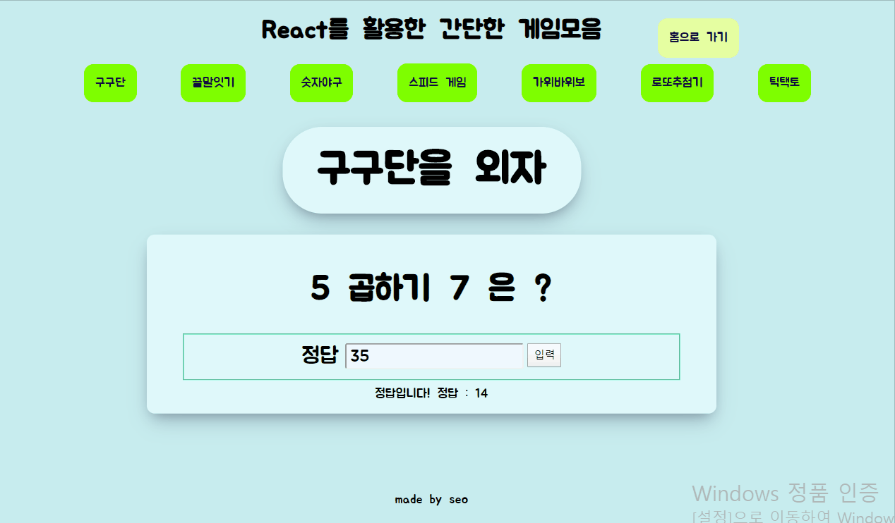
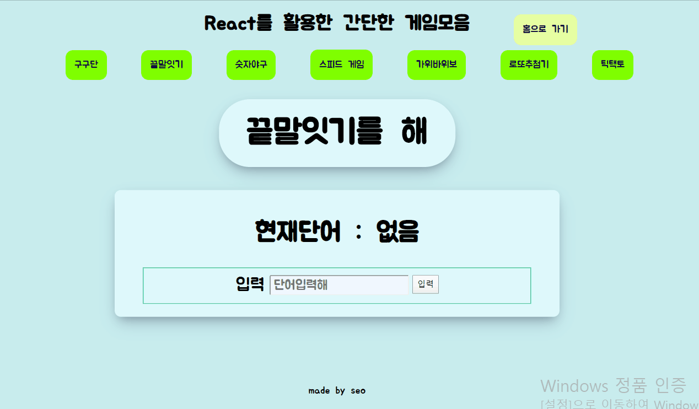
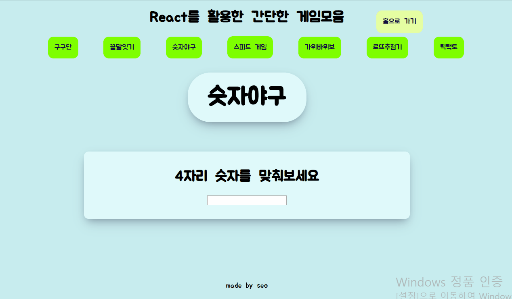
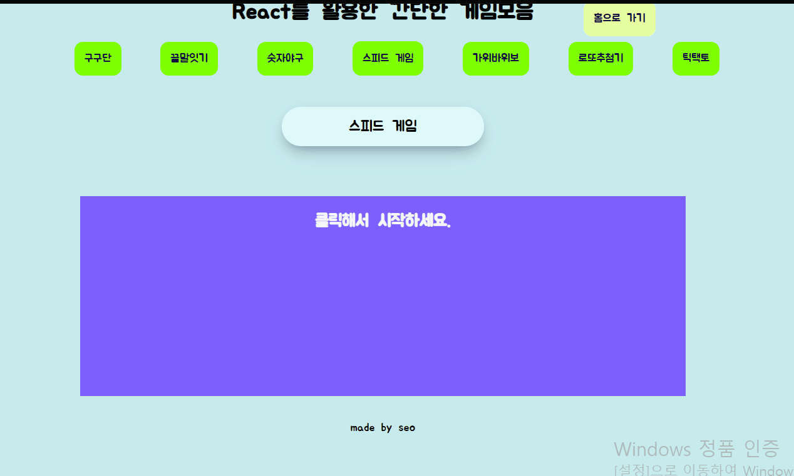
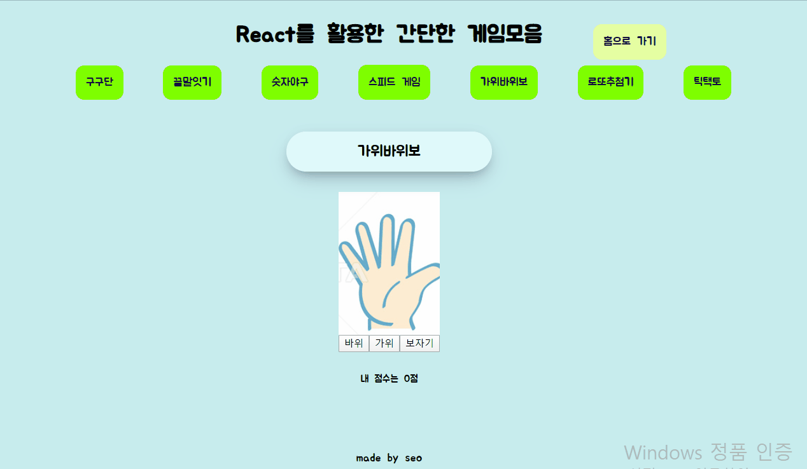
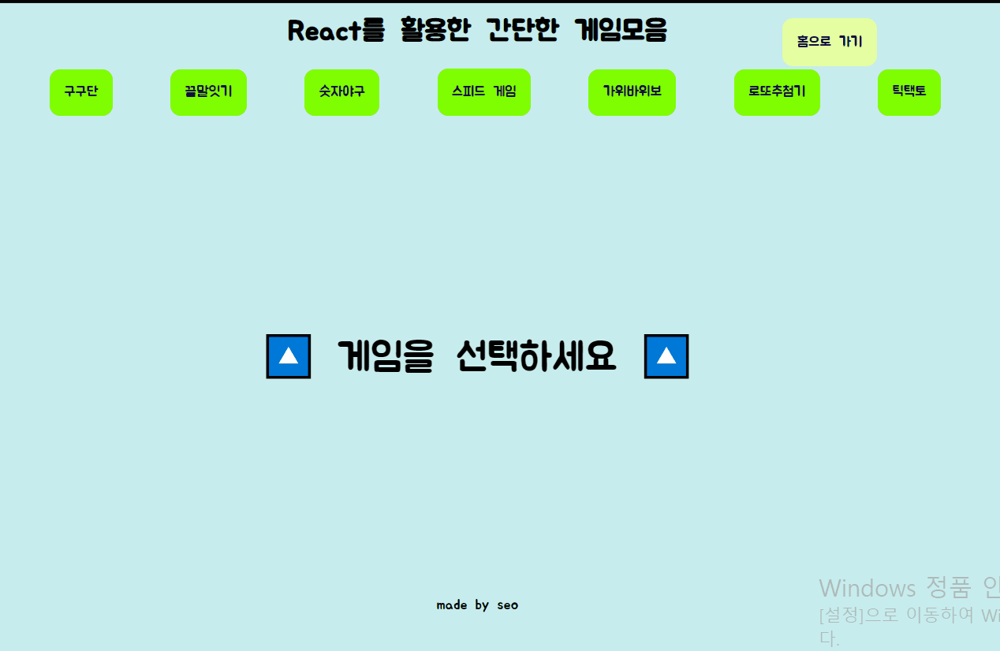
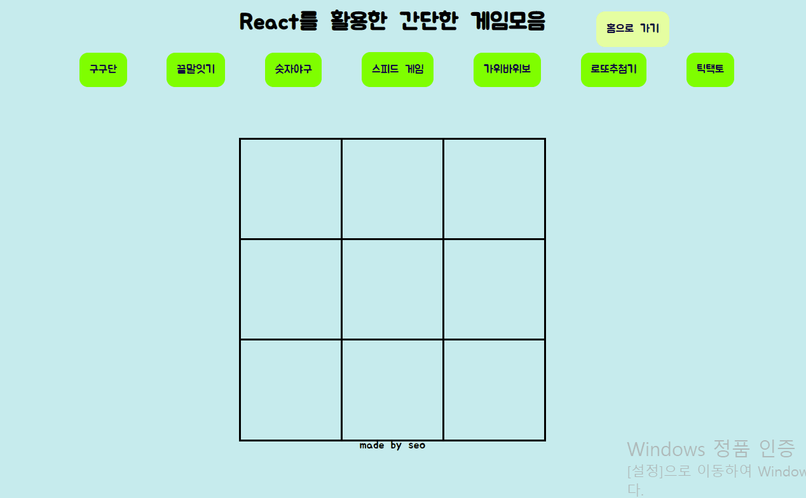

# React Game

#### 리액트로 만드는 간단한 웹 게임!😻

*게임의 재미보다는 리액트 구성을 느껴주세요..*

## 홈



## 주요특징

```bash
$ npm create-react-web
```

를 사용하지 않고 직접 빌드했습니다.
(babel,webpack)

| 빌드과정은 블로그에 기재

- [개발자 아저씨들 힘을모아][https://programming119.tistory.com/99]


## 게임 종류


- 구구단


---

- 끝말잇기


---

- 숫자야구


---

- 스피드 게임


---

- 가위바위보


---

- 로또추첨기


---

- 틱택토



## 문의 혹은 피드백

ddrrpg@naver.com 로 메일 주세요!

## Author

> [SeoSang](https://github.com/SeoSang) • <ddrrpg@naver.com>

> 블로그 : [개발자 아저씨들 힘을모아](https://programming119.tistory.com/)

### 참고 및 배운 곳

제로초님 강의를 보고 배웠습니다. 감사합니다.

- [제로초 블로그](https://www.zerocho.com/) / [유튜브](https://www.youtube.com/channel/UCp-vBtwvBmDiGqjvLjChaJw?sub_confirmation=1)